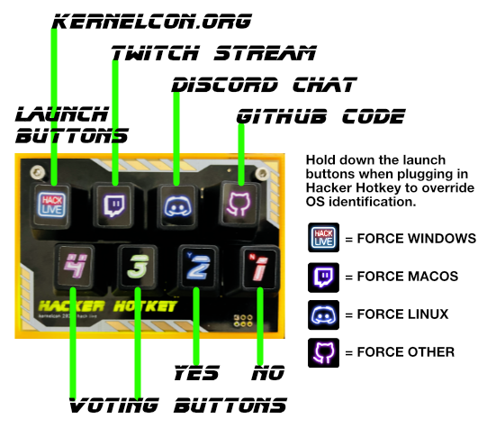

# Hacker HotKey
This repo contains example software for the [Kernelcon](https://kernelcon.org/) 2021 Hack Live! badge - the Hacker HotKey.

[](https://kernelcon.square.site/)

## Default Hotkey Mapping

[](https://kernelcon.square.site/)

Hacker Hotkey is configured by default to function with Kernelcon Hack Live!
The four Launch buttons on the top row attempt to identify your host operating system and use run commands to launch the web sites displayed.
The second row if voting buttons type the vote commands to participate in polls.
Of course Hacker Hotkey can be configured however you like after Hack Live...

## Compiling and uploading firmware

1. connect micro USB cable  
   * needs to be a data cable, not just a charging/power cable
2. open aduino IDE  
   * install if necessary 
       * https://www.arduino.cc/en/Guide
   * install keyboard library if necessary:
       * tools -> Manage Libraries -> search "keyboard" -> install
3. select "Arduino Leonardo" board type
   * install Arduino boards if necessary:
      * tools -> Boards Manager -> search "Arduino AVR Boards" -> install 
4. select com port
   * tools -> port
5. Verify port comms work
   * tools -> "Get Board Info"
   * should return something like
      ```sh
      BN: Arduino Leonardo
      VID: 0x2341
      PID: 0x8036
      SN: Upload any sketch to obtain it
      ```
6. choose your code
   * [hacker hotkey advanced](hackerhotkey-adv/hackerhotkey-adv.ino)
      * More advanced firmware if you just want to create powerful hotkeys without coding
      * Refer to the [Hacker Hotkey Advanced guide](README-adv.md) for configuring hotkeys
   * [hacker hotkey sample](hackerHotKey/hackerHotKey.ino) 
      * A simple firmware example that is a good starting point for developing your own code
7. upload code
   * sketch -> upload
   * Arduino IDE will compile and upload firmware to the Hacker Hotkey, which you can use immediately after upload (no unplugging, reseting, etc required)

## 3D Printing a case

We've designed a case for Hacker Hotkey, and while not necessary to function it does complete the look.  [Download the STL at Thingiverse](https://www.thingiverse.com/thing:4828073/apps)


